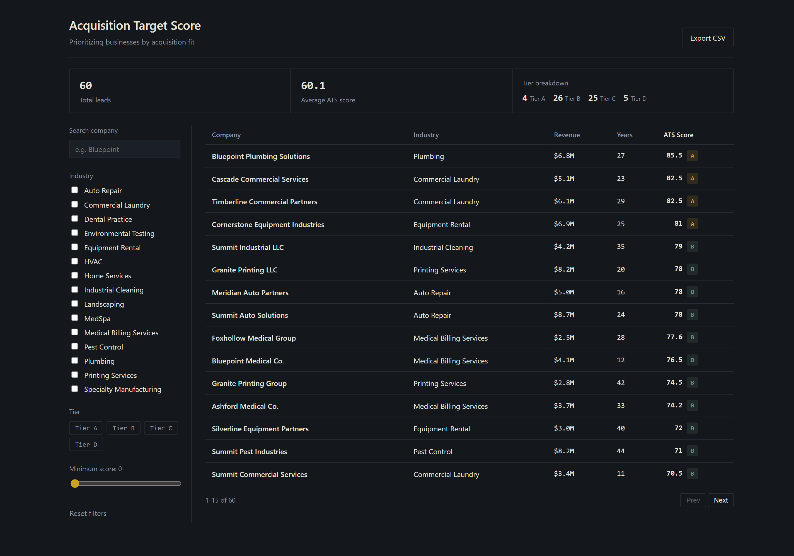
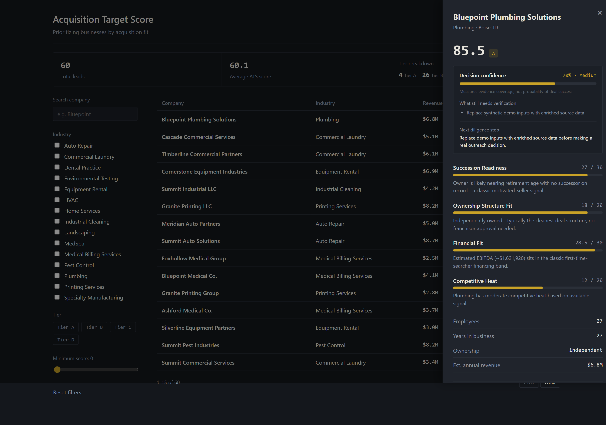
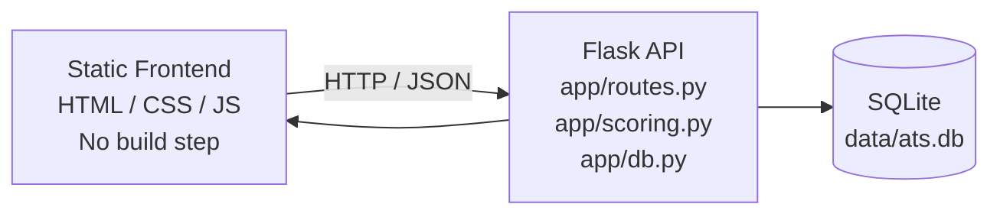

# Acquisition Target Score (ATS)

An acquisition-intelligence enhancement for SaaSquatch Leads, built for Caprae Capital's Full Stack Developer pre-work challenge.

> **Prioritizing businesses by acquisition fit, not sales readiness.**

**One-line pitch:** SaaSquatch helps teams source and review companies for outreach. ATS adds an acquisition-decision layer that re-ranks those businesses by acquisition fit, explains the score factor by factor, and separately shows how complete the underlying evidence is.



---

## Why this feature

Lead-generation tools are usually optimized to answer:

> Which companies are worth contacting?

For acquisition sourcing, that is only the first step. Searchers and operators also need to answer:

> Which businesses are actually attractive acquisition targets under a specific thesis?

ATS adds that decision layer.

The model evaluates each business across four explicit factors:

| Factor                  | Weight | What it captures                                                                         |
| ----------------------- | -----: | ---------------------------------------------------------------------------------------- |
| Succession Readiness    |    30% | Whether ownership and succession signals suggest a potentially motivated seller profile  |
| Ownership Structure Fit |    20% | Whether the business appears independent, franchised, PE-backed, or unknown              |
| Financial Fit           |    30% | Proxy EBITDA relative to a practical acquisition range for a first-time searcher         |
| Competitive Heat        |    20% | Whether the sector is heavily competed or offers a more proprietary sourcing opportunity |

Every weight and threshold is an explicit business assumption, not ground truth. The model is intentionally transparent so a reviewer can inspect, challenge, or modify a specific assumption without treating the score as a black box.

---

## ATS score vs. decision confidence

ATS answers:

> **How attractive is this target under the stated acquisition thesis?**

Decision confidence answers a different question:

> **How complete is the evidence behind that recommendation?**

Missing ownership, owner-age, succession, or financial inputs reduce confidence and become explicit diligence tasks rather than silently becoming negative scoring signals.

Synthetic demo records are capped at medium confidence so the interface never presents fictional inputs as verified real-world evidence.

An 85/100 target with 45% confidence therefore means:

> A potentially strong target that still requires additional diligence.



---

## Business sanity checks

These scenarios validate the **business behavior** of the scoring model. They are not claims that ATS predicts acquisition outcomes.

Each scenario lists the exact inputs used so the result can be reproduced directly with `compute_ats_score()`.

| Scenario                                        | Exact inputs                                                                                                                                | Expected behavior                       |   ATS result |
| ----------------------------------------------- | ------------------------------------------------------------------------------------------------------------------------------------------- | --------------------------------------- | -----------: |
| 25-year independent commercial laundry          | Industry=`Commercial Laundry`; years=25; ownership=`independent`; owner age=`60_plus`; successor=`False`; revenue=$6.0M; EBITDA margin=20%  | Strong proprietary target               | **91.5 / A** |
| PE-backed HVAC roll-up                          | Industry=`HVAC`; years=10; ownership=`pe_backed`; owner age=`45_to_60`; successor=`True`; revenue=$10.0M; EBITDA margin=20%                 | Weak / auction-prone target             | **42.5 / C** |
| Founder-owned SaaS, 4 years old                 | Industry=`SaaS`; years=4; ownership=`independent`; owner age=`under_45`; successor=`False`; revenue=$4.0M; EBITDA margin=20%                | Too early / small for the stated thesis | **57.8 / C** |
| 30-year independent industrial cleaning company | Industry=`Industrial Cleaning`; years=30; ownership=`independent`; owner age=`60_plus`; successor=`False`; revenue=$7.0M; EBITDA margin=20% | Strong proprietary target               | **91.5 / A** |
| Home-services franchise                         | Industry=`Home Services`; years=10; ownership=`franchise`; owner age=`45_to_60`; successor=`False`; revenue=$6.0M; EBITDA margin=20%        | Medium / weak despite financial fit     | **59.0 / C** |

The point is not that these values are universal truth. The goal is to ensure the ranking behaves consistently with the stated acquisition thesis and that every scoring assumption is inspectable.

---

## Architecture



### Stack

- **Backend:** Flask + Python standard-library `sqlite3`
- **Frontend:** Vanilla HTML, CSS, and JavaScript
- **Storage:** SQLite for the MVP
- **Scoring:** Deterministic, explainable rules calculated on read
- **Testing:** Python `unittest`
- **Production WSGI entry point:** `wsgi.py`

### Why this stack

This is intentionally a single-view, **Quality First** enhancement rather than a second lead-scraping product.

Flask + SQLite + vanilla JavaScript keep the executable path small, transparent, and easy to verify. The scoring engine is independent of the database layer, so the acquisition logic can be tested separately and moved behind a larger application stack later without rewriting the decision model.

---

## Running locally

### Backend

```bash
cd backend
python -m venv .venv
```

Activate the virtual environment.

**Windows PowerShell**

```powershell
.\.venv\Scripts\Activate.ps1
```

**macOS / Linux**

```bash
source .venv/bin/activate
```

Install dependencies, seed the demo dataset, and start the API:

```bash
pip install -r requirements.txt
python seed.py --count 60
python run.py
```

Backend:

```text
http://127.0.0.1:5000
```

### Frontend

In a separate terminal:

```bash
cd frontend
python -m http.server 8080
```

Open:

```text
http://localhost:8080
```

If the API is hosted somewhere other than `localhost:5000`, set `window.ATS_API_BASE` before `app.js` loads.

---

## Tests

Run the full suite:

```bash
cd backend
python -m unittest discover -s tests -v
```

Current suite:

- **23** scoring and evidence-confidence tests
- **14** Flask API integration tests
- **16** real-data parsing / NAICS-mapping tests
- **53 tests total**

The current project passes all 53 tests locally.

Coverage includes:

- score boundaries and tier behavior
- weighted scoring math
- unknown-data handling
- evidence-confidence behavior
- filtering and sorting
- pagination
- filtered summary statistics
- CSV export
- 404 handling
- ownership inference
- NAICS mapping
- source disclosure

---

## API reference

| Method | Path                    | Purpose                                                                                         |
| ------ | ----------------------- | ----------------------------------------------------------------------------------------------- |
| `GET`  | `/api/leads`            | List leads with scores; supports search, industry, tier, minimum score, sorting, and pagination |
| `GET`  | `/api/leads/<id>`       | Lead detail with factor breakdown and evidence-confidence assessment                            |
| `GET`  | `/api/leads/export.csv` | Export the currently filtered lead set as CSV                                                   |
| `GET`  | `/api/meta`             | Industries and valid ATS tiers used by the UI                                                   |
| `GET`  | `/api/stats/summary`    | Lead count, average ATS score, and tier breakdown using the active filters                      |

---

## Dataset and provenance

The repository provides two data paths.

### 1. Synthetic demo data

`seed.py` creates a deterministic dataset of 60 fictional companies using a fixed random seed.

- no real business is named
- records are reproducible
- `source_note` clearly identifies synthetic records
- demo records are capped at medium decision confidence

### 2. SBA real-data adapter

`fetch_real_leads.py` provides an ingestion path for public small-business records from the SBA Paycheck Protection Program FOIA dataset.

The adapter maps selected NAICS codes into the ATS industry taxonomy.

| Field                    | Treatment                            |
| ------------------------ | ------------------------------------ |
| Company name, city/state | Real source field                    |
| Employee count           | Real source field                    |
| Franchise signal         | Real source field used heuristically |
| Industry                 | NAICS code mapped into ATS taxonomy  |
| Revenue                  | Estimated                            |
| EBITDA margin            | Estimated                            |
| Owner age                | Unknown when not present             |
| Succession status        | Unknown when not present             |

Real, estimated, and unknown values are kept distinct in `source_note`.

Example commands:

```bash
cd backend
python fetch_real_leads.py --limit 120
python fetch_real_leads.py --limit 120 --merge
```

### Real-data verification status

The SBA ingestion parser, NAICS mappings, source-provenance handling, and error cases are covered by automated tests using records that match the documented PPP schema.

The live multi-hundred-MB SBA download has **not** been executed end-to-end in the development environment, so this repository does not claim live-ingestion verification.

No downloaded real-company records are committed, and no demo claim depends on the live ingestion path.

The adapter is included to demonstrate a clean real-data ingestion boundary. The core product is the acquisition-decision layer, not the PPP dataset.

---

## Reliability and data integrity

The implementation includes several safeguards around acquisition data and scoring:

- Unknown ownership is represented explicitly instead of being inferred as PE-backed.
- Missing succession information remains `None` rather than being treated as a confirmed negative.
- ATS score and evidence confidence are calculated separately, so incomplete data does not automatically make a company unattractive.
- Dashboard summary statistics use the same active filters as the lead table.
- External lead text is HTML-escaped before rendering.
- Numeric progress values are clamped to safe display ranges.
- Scoring, filtering, parsing, CSV export, and evidence handling are covered by 53 automated tests.

---

## Scaling this up

For a production version:

- **Database:** move from SQLite to PostgreSQL once concurrent writes or a larger dataset justify it.
- **Persistence:** persist scores and recompute on write or on a schedule rather than recalculating every list request.
- **Enrichment:** connect verified company-data sources behind the existing lead structure.
- **Authentication:** add per-user saved searches, lists, and role-based access.
- **Caching:** add Redis when scored result reuse becomes meaningful at scale.
- **Frontend:** migrate to React/TypeScript once the product expands beyond a single dashboard workflow.
- **Deployment:** a production architecture could use ECS Fargate + Gunicorn, RDS PostgreSQL, ElastiCache Redis, S3/CloudFront, and GitHub Actions → ECR → ECS.

The current implementation stays intentionally small because the objective is to validate whether acquisition-focused ranking improves the target-review workflow before adding infrastructure around it.

---

## Scope discipline

The project intentionally focuses on one high-impact workflow:

> **Source → rank by acquisition fit → inspect rationale → identify missing evidence → export a shortlist**

Authentication, CRM synchronization, LLM-generated outreach, and additional screens are reasonable follow-ups, but they are intentionally outside the MVP until the acquisition-ranking workflow itself is validated.

---

## Live demo

[Open the live demo](https://acquisition-target-score.onrender.com)
