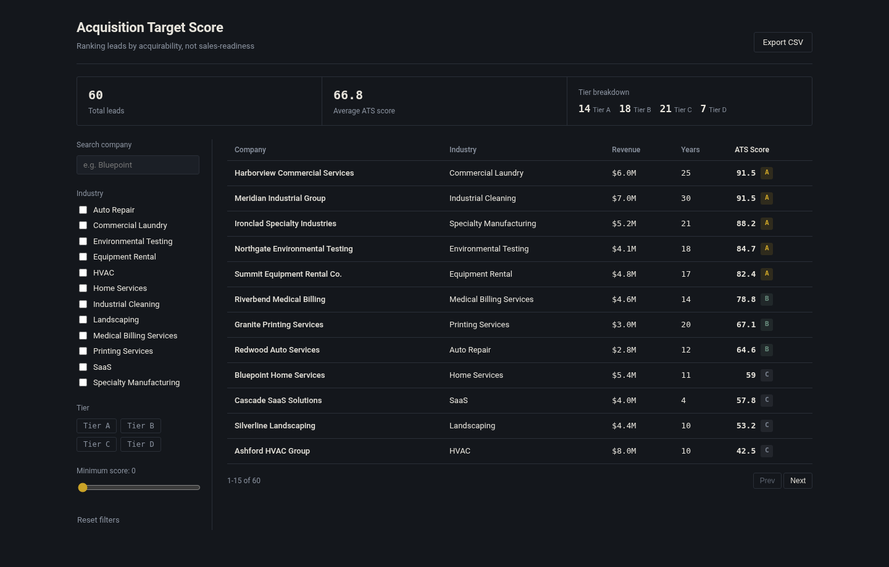

# Acquisition Target Score (ATS)

An enhancement to SaaSquatch Leads, built for Caprae Capital's Full Stack Developer
pre-work challenge.

**One-line pitch:** SaaSquatch scores leads for sales outreach (who is likely to
*buy something from you*). Caprae's actual users are searchers/operators looking
for businesses to *acquire*. Those are different, sometimes opposite, signals.
ATS re-ranks a lead list by acquirability, with a fully transparent, factor-by-factor
score breakdown instead of a black-box number.



## Why this feature, not something else

SaaSquatch pulls data from Apollo, LinkedIn, Crunchbase, Google Maps, and Growjo
and estimates revenue so users can decide which leads are worth enriching. That's
a sales-intelligence pattern. But Caprae's own published thinking (their "Why Most
Search Funds Fail" piece) argues that searchers waste time chasing an idealized
deal profile and LinkedIn-hyped categories (HVAC, med spas) instead of building
proprietary sourcing advantages in less-contested niches. A generic "lead score"
doesn't capture that. ATS operationalizes it directly:

| Factor | Weight | What it captures |
|---|---|---|
| Succession Readiness | 30% | Is the owner likely motivated to sell soon, with no internal successor lined up? |
| Ownership Structure Fit | 20% | Independent businesses are cleaner deals than franchises (franchisor consent, transfer fees) or PE-backed roll-ups (usually sold via competitive broker auction). |
| Financial Fit | 30% | Proxy EBITDA relative to the band a first-time searcher can realistically finance (~$1M–$5M). |
| Competitive Heat | 20% | Penalizes oversaturated, LinkedIn-hyped categories; rewards under-the-radar niches where a proprietary approach is more likely to work. |

Every factor's weight and threshold is a documented business assumption, not
ground truth (see `backend/app/scoring.py` docstring). The point of showing the
breakdown in the UI, not just a single number, is that a reviewer can disagree
with one specific input without having to trust or discard the whole score.

### ATS score vs. decision confidence

ATS answers **"How attractive is this target under the stated acquisition thesis?"**
Decision confidence answers a different question: **"How complete is the evidence
behind that recommendation?"** Missing ownership, owner-age, succession, or financial
inputs reduce confidence and become explicit diligence tasks rather than silently
turning into negative scores. Synthetic demo records are capped at medium confidence
so the UI never presents fictional inputs as verified real-world evidence.

This separation is deliberate: an 85/100 target with 45% confidence is a reason to
research, not a reason to pretend the investment case is already proven.

## Business sanity checks

These are scenario tests for the *business behavior* of the model, not claims that
ATS predicts acquisition outcomes. Each row below lists the exact inputs used so the
result can be reproduced directly with `compute_ats_score()`. If the model ranks a
clearly auctioned/over-competed profile above a proprietary-fit target, the weights
need revisiting.

| Scenario | Exact inputs used | Expected behavior | ATS result |
|---|---|---|---:|
| 25-year independent commercial laundry | Industry=`Commercial Laundry`; years=25; ownership=`independent`; owner age=`60_plus`; successor=`False`; revenue=$6.0M; EBITDA margin=20% (proxy EBITDA=$1.2M) | Strong proprietary target | **91.5 / A** |
| PE-backed HVAC roll-up | Industry=`HVAC`; years=10; ownership=`pe_backed`; owner age=`45_to_60`; successor=`True`; revenue=$10.0M; EBITDA margin=20% (proxy EBITDA=$2.0M) | Weak/off-market-unfriendly target | **42.5 / C** |
| Founder-owned SaaS, 4 years old | Industry=`SaaS`; years=4; ownership=`independent`; owner age=`under_45`; successor=`False`; revenue=$4.0M; EBITDA margin=20% (proxy EBITDA=$0.8M) | Too early/small for the stated thesis | **57.8 / C** |
| 30-year independent industrial cleaning company | Industry=`Industrial Cleaning`; years=30; ownership=`independent`; owner age=`60_plus`; successor=`False`; revenue=$7.0M; EBITDA margin=20% (proxy EBITDA=$1.4M) | Strong proprietary target | **91.5 / A** |
| Home-services franchise | Industry=`Home Services`; years=10; ownership=`franchise`; owner age=`45_to_60`; successor=`False`; revenue=$6.0M; EBITDA margin=20% (proxy EBITDA=$1.2M) | Medium/weak despite financial fit | **59.0 / C** |

The point is not that these numbers are universal truth; it is that the ranking is
consistent with the assumptions stated above, the exact scenario inputs are visible,
and every scoring assumption is inspectable.

## Architecture

```
┌─────────────────┐        HTTP/JSON        ┌──────────────────────┐
│  Static frontend │ ─────────────────────▶ │  Flask API            │
│  (HTML/CSS/JS,   │ ◀───────────────────── │  app/routes.py        │
│  no build step)  │                         │  app/scoring.py       │
└─────────────────┘                         │  app/db.py (sqlite3)  │
                                              └──────────┬───────────┘
                                                          │
                                                    data/ats.db
```

- **Backend:** Flask + stdlib `sqlite3` (no ORM). One table (`leads`), scored
  on read rather than persisted, since the scoring rules are expected to
  change independently of the schema during early iteration.
- **Frontend:** vanilla HTML/CSS/JS, no bundler. For a single-view dashboard
  at this scope, a build step adds process without adding capability.
- **Storage:** SQLite for the MVP. See "Scaling this up" below for the
  Postgres path.

### Scope and implementation choices

This is intentionally a single-view, "Quality First" enhancement rather than a
second lead-scraping product. Flask + SQLite + vanilla JavaScript keep the executable
path small, transparent, and easy to verify within the challenge scope. The scoring
engine has no database/framework dependency, so the business logic can be tested
independently and later moved behind a larger FastAPI/React stack without rewriting
the decision model.

## Running it locally

**Backend**
```bash
cd backend
python3 -m venv .venv && source .venv/bin/activate   # or your preferred env tool
pip install -r requirements.txt
python seed.py --count 60          # populates data/ats.db with the mock dataset
python run.py                       # dev server on http://localhost:5000
```

**Frontend** (separate terminal)
```bash
cd frontend
python3 -m http.server 8080         # any static file server works
```
Then open `http://localhost:8080`. If your API isn't on `localhost:5000`,
set `window.ATS_API_BASE` before `app.js` loads (see `index.html`).

**Tests**
```bash
cd backend
python -m unittest discover -s tests -v
```
53 tests in the suite: 23 unit tests on the scoring/evidence
engine (boundary values, tier thresholds, weighting math, unknown-data
handling, evidence-confidence behavior), 14 integration tests on the Flask API (filtering, sorting,
pagination, CSV export, 404 handling, filtered stats) using Flask's test
client, and 16 tests on the real-data parsing and NAICS-mapping logic used
by `fetch_real_leads.py`.

## API reference

| Method | Path | Purpose |
|---|---|---|
| GET | `/api/leads` | List leads with scores. Query params: `search`, `industry` (comma-separated), `tier` (comma-separated), `min_score`, `sort_by`, `sort_dir`, `page`, `page_size`. |
| GET | `/api/leads/<id>` | Full detail + factor-by-factor score breakdown + diligence-confidence assessment. |
| GET | `/api/leads/export.csv` | CSV export respecting the same filters. |
| GET | `/api/meta` | Distinct industries + valid tiers, for populating filter UI. |
| GET | `/api/stats/summary` | Total leads, average score, tier counts. |

## The dataset

This challenge doesn't include access to SaaSquatch's live data sources
(Apollo, LinkedIn, Crunchbase, Google Maps, Growjo) or scraping credentials.
Two paths are provided, and they can be combined:

**1. Synthetic (`seed.py`)** — a deterministic generator (60 fictional
companies, seeded RNG). Every field is disclosed as synthetic in the
`source_note`. No real business is named or profiled.

**2. Real (`fetch_real_leads.py`)** — pulls actual small-business records
from the SBA's official Paycheck Protection Program FOIA dataset
(`data.sba.gov`, public, no API key, no scraping — a direct government CSV
download; NAICS industry codes map to our taxonomy, see the script for the
mapping and its confidence level per code). Per real record:

| Field | Real or estimated? |
|---|---|
| Company name, city/state | **Real** (from the source record) |
| Employee count | **Real** |
| Franchise flag → ownership type | **Real** signal, heuristic mapping |
| Industry | **Real** NAICS code → our category (some codes are broader than our label; disclosed per-code) |
| Revenue, EBITDA margin | Estimated — no public dataset legitimately reports this without asking the owner |
| Owner age, succession status | **Unknown** — not present in the source, so ATS does not invent a value |

Every real record's `source_note` states exactly which fields are real and
which are estimated — they are never blended without disclosure.

```bash
cd backend
python fetch_real_leads.py --limit 120           # preview matches first
python fetch_real_leads.py --limit 120 --merge    # insert into data/ats.db
```

**Real-data verification status:** the SBA ingestion parser, NAICS mappings, source
provenance, and error handling are covered by 16 automated tests using records that
match the documented PPP schema. The live multi-hundred-MB SBA download has **not**
been executed end-to-end in the development environment, so this repository does not
claim live-ingestion verification. No downloaded real-company records are committed.
The commands above are included for reproducible execution against the current official
SBA source, and any schema/source changes should be reviewed before using the adapter
for an actual sourcing decision. No demo claim depends on the live ingestion path; the
included dataset is explicitly synthetic, and real, estimated, and unknown fields are
kept separate in `source_note`.

The real-data adapter is included to demonstrate that ATS has a clean ingestion
boundary; the core product is the acquisition-decision layer, not the PPP dataset.

## Scaling this up (what I'd do with more time / at production scale)

- **Database:** Postgres instead of SQLite once there's concurrent writers
  or the dataset grows past what fits comfortably in memory per request.
  SQLAlchemy becomes worth its overhead at that point (multi-table joins,
  migrations via Alembic).
- **Scoring:** currently computed on every read. At scale, persist the score
  alongside the lead and recompute on a schedule (or on write) rather than
  on every list request.
- **Real enrichment:** replace `seed_data.py` with actual connectors (Google
  Maps for location/size signals, state business registries for years-in-business,
  a paid data provider for financials) behind the same `LeadFinancials` shape,
  so `scoring.py` doesn't need to change.
- **Auth & multi-tenancy:** none of this has auth. A real deployment needs
  per-user saved filters/lists and role-based access before it touches real
  company data.
- **Deployment (production architecture):** AWS ECS Fargate running the
  Flask app behind gunicorn (per `wsgi.py`); RDS PostgreSQL for storage;
  ElastiCache Redis for the scored-result cache once scoring moves off the
  read path; S3 + CloudFront for the static frontend; GitHub Actions →
  ECR → ECS for deployment. That's a specific choice, not a menu — picked
  for being the standard, well-documented path for a small Flask service
  with a static frontend, not because it's the only option. Not deployed
  for this submission; happy to walk through standing it up on Render or
  Fly (faster to get a live URL than full ECS) if useful for the interview.
- **Frontend:** if this grows past one dashboard view (saved searches, CRM
  sync, team collaboration), migrate to React/TypeScript. Vanilla JS was the
  right call for one view; it stops being the right call for five.

## Fixes applied after self-review

A few issues were caught and fixed after the initial build, before this
submission:

- **Industry column wasn't actually sortable.** The table header offered
  it, but the backend's allowed sort fields didn't include `industry`, so
  clicking it silently fell back to sorting by score. Fixed in
  `app/routes.py`; regression test added in `tests/test_api.py`.
- **`Corporation` business type was being used to infer PE-backed
  ownership.** Incorporation status says nothing reliable about who holds
  equity — that was a manufactured signal, not a real one, and it fed
  directly into 20% of the score. Fixed by adding a genuine `unknown`
  ownership category that scores neutrally instead of being penalized as
  PE-backed; only a real franchise-name signal now maps to a specific
  category. Regression tests added.
- **Real-data succession status was stored as `False` (confirmed no
  successor) when it should have been `None` (unknown).** Those are
  different claims — the SBA dataset never actually reports succession
  status. Added proper tri-state handling (`bool | None`) through the
  scoring engine, database schema, and API. The scoring math was already
  unaffected either way (neither `False` nor `None` triggers the penalty),
  but the field now says what's actually true.
- **The stats bar ignored active filters** — it always summarized all 60
  leads even when the table below it was filtered down to 4. Fixed by
  having `/api/stats/summary` share the same filter pipeline as
  `/api/leads`; the frontend now relabels the stats as "filtered" when a
  filter is active.
- **External lead text was rendered through `innerHTML` without escaping.**
  Because real lead data can come from third-party sources, company names, industries,
  locations, rationale text, and source notes are now HTML-escaped before rendering;
  numeric progress widths are clamped to 0-100.
- **Attractiveness and evidence quality were conflated.** ATS now exposes a separate
  decision-confidence assessment showing missing evidence and the next diligence step,
  without changing the acquisition score simply because a source lacks a field.

The regression fixes are covered by tests; the repository now contains 53 tests in total.

## Scope discipline

The challenge's five-hour engineering constraint is treated as a product constraint:
this submission intentionally concentrates on one acquisition-decision workflow rather
than adding authentication, CRM sync, LLM-generated outreach, or additional screens.
Those are sensible follow-ups only after validating whether ATS improves target review.
